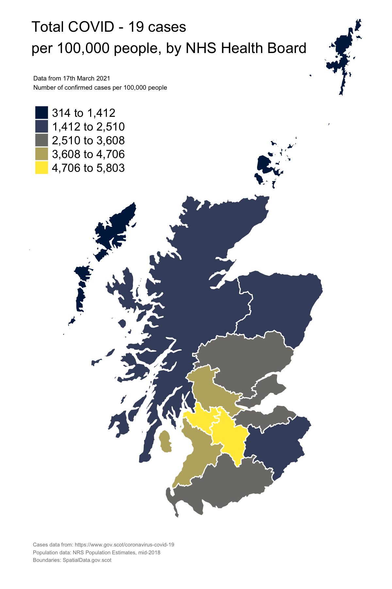
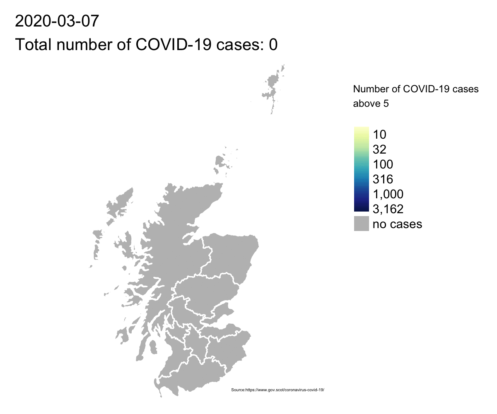

<style>
div.blue { background-color:#D3D3D3; border-radius: 5px; padding: 20px;}
</style>
<div class = "blue">
Some personal and computational notes loosely based on the analytical work I have done in response to COVID-19 pandemic in Scotland.
In my GIS Analyst role I use wide range of proprietary and open source GIS software as well as tend to blend R and Python languages. 
Here is a flavor of my work in open and reproducible notebook, following a Donald Knuth's "literate programming" paradigm.
</div>


```{r setup, include=FALSE}
knitr::opts_chunk$set(echo = TRUE)
```

## Packages

First,all packages necessary for the analysis.
```{r packages, echo=TRUE, message=FALSE, warning=FALSE, paged.print=FALSE}

library(dplyr)
library(tidyr)
library(lubridate)
library(readr)
library(ggplot2)
library(sf)
library(stringr)
library(tmap)
library(hrbrthemes)
library(zoo)
```

## Data Wrangling

Now, lets read the data from the *Data Science Scotland* repository

```{r message=FALSE, warning=FALSE, paged.print=FALSE}
cases_scot = read_csv("https://raw.githubusercontent.com/DataScienceScotland/COVID-19-Management-Information/master/COVID19%20-%20Daily%20Management%20Information%20-%20Scotland%20-%20Testing.csv") %>% 
  select(Date,'Testing - Cumulative people tested for COVID-19 - Positive') %>% 
  rename(total = 'Testing - Cumulative people tested for COVID-19 - Positive') %>% 
  mutate(date = as.Date(Date, "%d-%b-%Y"))
  

# deaths 
deaths_scot = read_csv("https://raw.githubusercontent.com/DataScienceScotland/COVID-19-Management-Information/master/COVID19%20-%20Daily%20Management%20Information%20-%20Scotland%20-%20Deaths.csv") %>% 
    rename(total = 'Number of COVID-19 confirmed deaths registered to date') %>% 
    mutate(date = as.Date(Date, "%d-%b-%Y"))

```

Since we only have on variable with total cases and deaths, we are going to calculate additional attributes: 
daily new cases, percentage change and seven days rolling average.

```{r message=FALSE, warning=FALSE, paged.print=FALSE}

#cases 
cases_scot  = cases_scot  %>% 
mutate(new_cases = (total - lag(total)), # new daily cases 
       pct_change = new_cases / lag(total) * 100, # percentage change
       cases_07da = rollmean(new_cases, k = 7, fill = NA)) # 7 days rolling average


# deaths
deaths_scot  = deaths_scot  %>% 
mutate(new_deaths = (total - lag(total)), # new daily cases 
      pct_change = new_deaths / lag(total) * 100, # percentage change
      deaths_07da = rollmean(new_deaths, k = 7, fill = NA)) # 7 days rolling average


```

## Plotting

We are ready to plot our variables using **ggplot** package

```{r message=FALSE, warning=FALSE, paged.print=FALSE}

ggplot()+
  geom_line(data = cases_scot, aes(x=Date, y=new_cases), color='gray') +
  geom_line(data = cases_scot, aes(x=Date, y=cases_07da), color='#ba0000') +
  labs( title = "Scotland's 7 days rolling average COVID-19 cases",
        subtitle = "Between March 2020 and March 2021", 
        caption="Source:https://github.com/DataScienceScotland/COVID-19-Management-Information ",
        y = "Cases", 
        x = "Month") +
  scale_x_date(date_breaks = '1 month', date_labels = '%m %y') +
  scale_y_log10() +
  hrbrthemes::theme_ipsum()
```

## Mapping

We can also create a map showing latest cases at NHS Health Board level.
But first we need to get the data for each geograph unit.

```{r message=FALSE, warning=FALSE, paged.print=FALSE}
# load data
cases_by_hb = read_csv("https://raw.githubusercontent.com/DataScienceScotland/COVID-19-Management-Information/master/COVID19%20-%20Daily%20Management%20Information%20-%20Scottish%20Health%20Boards%20-%20Cumulative%20cases.csv")

# pivot data to long format nd select latest date
last_cases_by_hb_long = cases_by_hb %>%
pivot_longer(!Date,names_to = "hb_name", values_to = "cases")  %>%
mutate(cases = as.numeric(cases)) %>% 
filter(Date == max(Date))

# load mid 2019 population estimatie
pop_hb = read_csv("data/hb_pop_2019.csv")

# first join: cases with population, also calculate rate per 100k
cases_by_hb_pop = left_join(last_cases_by_hb_long, pop_hb) %>% 
  mutate(
    rate_100k = cases / hb_pop * 100000
  )

# load Health Board geographies
health_boards = st_read("data/SG_NHS_HealthBoards_2019.shp", quiet = TRUE)

# second join: health board boundaries 
cases_hb_rate100k = left_join(health_boards,cases_by_hb_pop, by = c("HBCode" = "hb_code"))


```

Finally, we are ready to produce the map using **tmap** package. 
Note that we are saving the output to png file.

```{r message=FALSE, warning=FALSE, paged.print=FALSE}

map = tm_shape(cases_hb_rate100k) +
  tm_polygons(col = "rate_100k",
              title = "Data from 17th March 2021 \nNumber of confirmed cases per 100,000 people",
              lwd = 1,
              border.col = "white",
              style = "equal",
              n = 5,
              palette="cividis" # choose between reds or cividis
             # legend.format=list(fun=function(x) paste0(formatC(x, digits=0, format="f")))
              ) +
  tm_layout(
           # fontfamily = "arial",
            title = "Total COVID - 19 cases \nper 100,000 people, by NHS Health Board",
            title.size = 0.9,
            legend.title.size = 1,
            attr.outside= TRUE,
            attr.outside.position = "bottom",
            attr.outside.size = .1,
            attr.just = c("left", "top"),
            inner.margins = 0.02,
            outer.margins = c(0,0.01,0.01,0.01),
            asp = 4/6,
            frame = F,
            design.mode = F
           ) +
  tm_credits("Cases: https://www.gov.scot/coronavirus-covid-19\nPopulation data: NRS Population Estimates, mid-2018\nBoundaries:  SpatialData.gov.scot",
             col = "grey50",
             position=c("left","top"), 
             align = "left",
             size = 0.325)
# save graphic to png file
tmap_save(
  tm = map,
  filename = "output/hb_map_cases_rate.png",
  height = 6,
  width = 4,
  units = "in",
  asp = 4/6
)
```

Ok, map is ready !

```{r, echo=FALSE, out.width= 600, fig.cap="", fig.align='left'}

```

I can't recommend **tmap** package enough.

```{r, echo=FALSE, out.width= 600, fig.cap="", fig.align='left'}

```

## Session info

```{r}
sessionInfo()
```


&nbsp;
<hr />
<p style="text-align: center;">A work by <a href="https://github.com/topographos/">Michal Michalski</a></p>
&nbsp;
